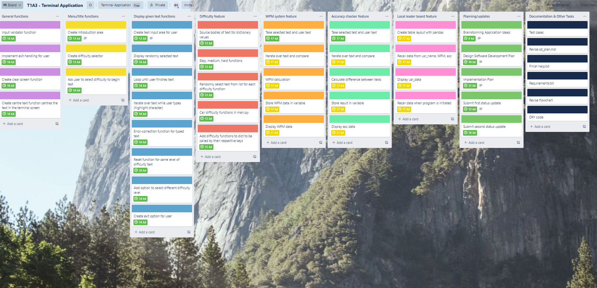
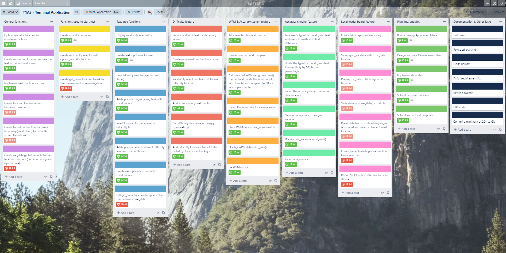

# Software Development Plan

## Statement of Purpose and Scope

### Application Description:

This terminal application is a speed typing test. The user is able to select the desired difficulty level of the text that is given to them, ranging from easy, medium, and hard. The test begins once the user begins typing. Once the user finshes typing out the given text, the application reports the user's WPM (words per mintue), and the accuracy of words typed. The application then asks the user if they want store their name, accuracy, and WPM in the leader board while taking them to it, reset the application or to exit the program. 

### What Problem it is Designed to Solve:

The application is designed to improve the users typing speed and accuracy while testing themselves against different levels of difficulty in text. As I believe that possessing adequete typing skills is essential in many technological aspects in many industries and the importance of having competent typing skills is becoming imperative in the ever-evolving technological industries. It can improve the users working efficiency and in turn the work quality. This allows for time to be spent on other prevelant tasks.

Not only does frequently testing one's own typing ability improve typing efficiency, it can also serve as a form of entertainment. Competing against yourself or other friends can foster a competitive atomsphere and users will possilby stop seeing the application as a test and more as a form of entertainment.

### Target Audience:

The target audience for the application is for people endeavouring to improve their own typing skills. Depending on the difficulty level the user chooses, the range of the target audience changes. Such as, the easy level is more designed towards elementary/primary school students from the grades of 1-6. While the medium difficulty is more suitable for high school/secondary students randing from the grades of 8-12. Finally the hard difficulty level is desgined for college students.

### How a User will use the Application:

The user will use the application on their respective computer device. The program will run through the command line in their terminal with the ./wrapper.sh script and the user may complete as many tests as they desire. Albeit the application is designed for single user use, the user may compete against another user physically or virtually.

## Features:

• **Title Area & Difficulty Selector.**

To begin development on the application, a title is required to greet the user and offer options. The introduction would simply include the title of the application and ask the user for their name. The user is then taken to the text area. The applications then displays options for the user to select (1 - to show text and begin typing, 2 - select new difficulty, 3 - exit the application). 

If 1 is selected the user the program displays a transition message and then the text appears with a input box below for the user to type. 

If 2 is selected the user taken back the difficulty select screen while wiping the stored text data.

If 3 is selected, the application displays a message and exits with sys.exit() in the exit_test() function.

• **WPM System** 

One of the integral parts of a speed typing test is the WPM system, this system records the users words typed per minute. Specifically for this appilcation, it uses the net WPM to accurately report the users words typed per minute and it accomodates the users errors made while typing the given text and the errors that were also corrected while typing. This way it not only encourages speed typing, but to also precisely type the text to improve effiency. Although the gross WPM is used in the formula to calculate the net WPM, such as the following:

• **Accuracy Checker**

Another important feature to a speed typing test is to report the user's accuracy of the typed text. This is similar to the WPM system but is fundamentally different. It takes the total errors made within the user's input to the text, whether it was corrected or not. This can be calculated by taking the correct number of correct characters typed divided by the total characters given, and then mulitplied by 100%. This reports a more organic representaion of a user's typing accuracy.

• **Leaderboard System**

The leaderboard system is nice way for user's to record their WPM after completing a given text. The user's name, WPM and accuracy are recorded and displayed using the pandas module to create a leaderboard table in the terminal, this way the user can either strive to compete with themselves and aim for a better WPM or use it as a tool to compete with others by sharing their statistics with others. The data itself will be stored in text file so that they data is persistent when the program closes. 

## Intended User Experience/Interaction

The user will open the application to menu screen with a simple title of the application, accompanied with options of difficulty for the given text and the option to press enter to begin the test / and the application will notify them when the test will begin.

The application will supply the user with a body of text to complete, once the user begins typing the timer will begin. 

Once the user completes the text, the application will display their WPM, accuracy, and time it took to complete that text.

The user will also be given the option to select another difficulty, try another body of text from the same level of diffculty they selected (view the leaderboard) or exit the application.

## Control Flow Diagram

 

## Implementation Plan

To accommodate for the limited time frame of designing and creating this application, I utilized multiple project management tools. This included Trello as the main tool to track the development of the application but this was also accompanied by a workflow table to accurately keep track of time allotted to each task. 

Trello board 1:

Trello board 2:

Trello board 3:

Trello board 4:

Trello board 5:

Trello board 6:

Find below the tasks/features that were prioritsed in order of importance of implementing and completing the application:

• (Priority 1): Creating a introduction and text area to display text and aloow user input

    1. Displaying the title and the relevant information to the user
    2. Create input validator for user input (num input)
    3. Creating options for the user to select in regards to preffered difficulty using the difficulty selector funtion
    4. Display option to exit application
    5. Timer begins after transtion() then user begins typing
    6. Timer ends once user presses enter key
    7. Display user's accuracy and WPM
    8. Show options to see leader board, reset test or exit 

• (Priority 2): Create difficulty selection function in external program (texts.py)

    1. Utilize external library of text (Source: typracer.com)
    2. Open the file with json and gzip modules (native to Python)
    3. Create empty lists for diffierent level of texts (easy, medium, hard, all text)
    4. Use for loop to extract the text based length and append to empty lists
    5. Create functions to call respective lists (easy(), med(), hard, all())
    6. Use random.choice() on the text stored in the lists
    7. Return the randomly selected text

• (Priority 3): Creating the WPM system to record the user's typing productivity
    
    1. Implement timing feature to record speed in WPM (using the time module)
    2. Using split() method on the length of the typed text by the user
    3. Take the time taken by user to type text 
    4. Divide the word count of user's text by the time taken to type
    5. Multiply by 60 to return in minute form
    6. Round the returned value to display nicely (2 decimal point)
    7. Record the calculated WPM and storing that value to be displayed

• (Priority 4): Implementing accuracy checker:

    1. Comparing typed entry to given text entry
    2. Using split() method on the length of the typed text by the user
    3. Using the length of both texts and storing in a set variable
    4. Divide the set variable by the word count and multiplying by 100 to return percentage
    5. Round the returned value (2 decimal point)
    6. Storing and displaying the recorded accuracy value when called

• (Priority 5): Creating local leader board system for user

    1. Display option to proceed to leaderboard after given text is completed
    2. Design leader board layout/format
    3. Storing the correct values in the appropriate column ("| Name|  | Accuracy (%) | | WPM |")
    4. Store the values in external value to be called in leader board 
    5. Display only 10 entires in table
    6. Sort by highest accuracy
    7. Give user option to exit or reset test

• (Priority 6): Error Handling:

    1. Implement a validator fucntion for numbered options
    2. Utilize try and except blocks for erroneous

• (Priority 7): Documentation:

    1. Create and revise software development plan
    2. Control flow diagram
    3. Implementaion plan
    4. Help file for users
    5. Requirements file for dependencies needed for main program
    6. Test case spreadsheet

## Test Cases Table 

## Resources 

TypeRacer. 2021. TypeRacer - the global typing competition. [online] Available at: <https://play.typeracer.com/> [Accessed 20 July 2021].